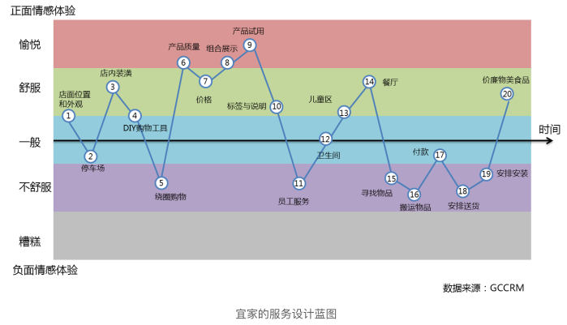

看人看五层：**感知层、角色层、资源层、能力圈和存在感**。 

你最在意哪一层，你最不能忍哪一层？ 

一个人的内核，就是他**对自己存在感的定义**。 

> 这里不说存在感。我突然意识到我是一个很虚伪的人。一方面说要做自己，然后不去追求那些美的、好的东西，可我内心的确就是追求这些啊，我对不美的东西就是很讨厌，我就是有洁癖、我就是有整理癖、我就是有收集癖啊。内心有些东西是好的，那我就应该去追求，不好的就放弃。这才是追求自我意识。

没有任何一个人是完美适配另一个人的成熟产品，你需要看到的是一个人能够持续让自己变化的内在的动力。 然后在漫长的不确定的未来里，你们两个人是不是能够一起拥抱不确定，拥抱变化，在变化中变得成熟，彼此适配。 

### 1、同理心

#### 同理心训练：怎样理解愉悦和不爽

满足就愉悦，不满足就不爽，压抑了很久的需求突然被满足就是爽。

拉动你玩游戏的，就是微小的愉悦感，和崩了很久的需求，突然被满足的爽感。加在一
起，这种确定性的满足就会成瘾。 

案例：微信和支付宝红包的爽与不爽

觉察一下自己，是不是有一件事，你可以不厌其烦地一直做下去？**你不厌其烦的地方，就是你的天分所在**。你会对某些东西感到愉悦，这个东西持续给你满足感，你可以一直花时间在这里，不厌其烦。时间久了，其实你就会与众不同。 

所以，你吸收谁的营养，你就变成谁。你靠什么满足你，你就会成为它的样子。什么东西持续满足你，什么东西永远让你不爽，这就是你的命运。 

#### 同理心训练：怎样理解愤怒与恐惧 

愤怒和恐惧也是同生的一对感觉，都是来自于被侵犯。

愤怒，就是感觉到自己的边界被侵犯。

本质上，愤怒其实是一种恐惧。

焦虑呢？焦虑也是恐惧。它来自对恐惧的想象。

羞耻感也是一种恐惧，它来自对社会评论的恐惧。

##### 恐惧是边界

当你很努力地想说服一个人，去做一件你看来非常正确的动作时，对方不动，不是道理他不懂，而是他内心有恐惧，但他不愿意告诉你。

劝人就5分钟。5分钟没说动的事，就不再劝了。而是应该想想，捆住他手脚的是什么。是什么把他压在那里，让他没办法往前走。

后天的知识技能道理逻辑都是一个一个的App，而你内在的愉悦、恐惧才是操作系统。有时候你不是缺某个App，而是你的操作系统，只能支撑你到这里了。

**看到一个人的恐惧，你就基本上知道他的边界在哪里。**

##### 恐惧是动力

恐惧是另外一种动力，甚至比愉悦的动力更为强大，或者说更强劲。

面对一个年轻人，如果他在工作中，既没有愉悦，也没有恐惧。你基本上可以判断，他在这件事上，不会有什么成就。

##### 恐惧是痛点

要么做一个让人愉悦到爆爽的产品，要么做一个可以帮人抵御恐惧的产品。

如果做一个看上去可以某种程度帮人不再难受，而在“爽”和“恐惧”无所作为的产品，那就是一个不痛不痒的产品，也许也有人会买单，但绝不会大火。

每个人的痛点都是他的恐惧，恐惧是痛点。人们会为了解决恐惧，毫不犹豫地花钱。看看医疗、医美和教育市场就知道了。

#### 同理心训练：产品要顺应用户潜意识 

因为人会基于自身所处的角色、所在的场景和个人的认知判断，选择性地说一些他觉得
正确的话。

我们要学会体会各种人的情绪与潜意识；不被一个人基于角色化交流而说出的言辞所迷惑；看到人基于潜意识流露的真实选择。 

一个好销售擅长的就是打破防御 ；一个好产品经理，则是根本不让用户启动防御。

不要让我思考，意识即防御。

一个产品要做到的就是迎合用户潜意识下的选择。熟悉的感觉就是潜意识里觉得安全的感觉，这样就不会触发防御。 

 所谓的用户调研，就是清空自己，接纳别人的世界观。

#### 警惕“集体人格”的误导 

集体其实就是一堆角色。 

教育是反人性的，它是一个把人角色化的过程。书读得越多的人越容易理想化，说得俗一点，就是不接地气。

做产品要**放弃对用户的角色化预期**，放弃设想用户“应该”怎么做，要去**发现真实的的用户**，学会对一个真实、完整、鲜活的人的观察和接纳。

人其实只有在压力非常大的情况下，才会去扮演角色。除非你能给他的压力非常到位，
否则就不要对他做角色化预期。

集体人格就是反人性的。

- 如果你的产品的使用对象是一个“个体”，那你必须要抛开对个体角色化的刻板想象，而把对方当成一个完整的、鲜活的人，去做用户研究。

- 但如果你是在给一个特定的集体做产品，那你应该充分研究这个集体的集体人格、共同记忆和核心观念。

角色化生存就是我们真实的生存处境，但是只有去角色化地认识、沟通、交互，你才能够得到真正的感情。 

**思考：**

- 你觉得自己是不是擅长角色化生存，或者擅长把别人训练成角色呢？ 

- 你能够去角色化地和别人建立真实的交流吗？

#### 自我与自律，哪一种更贴近产品精神 

做产品经理的人善于用右脑思考，而其他流程管理者更需要动用左脑。

左脑发达的人：

- 逻辑推理能力强、时间观念强，同时感受力差；

- 因为感受力差，所以没那么敏感和情绪化，整个人体现为情绪稳定，甚至刻板；

- 更容易根据规则调适自己，更自律，更容易角色化。

右脑发达的人，就正好相反：

- 感受力强； 

- 能在别人已经有结论的地方，建立自己的新观察，并且不太喜欢听已有的逻辑；

- 难以控制自己的情绪，能激情地表达自己，具有人格魅力。 

自我的人更适合做产品经理。 因为创造力是自我的延伸，而控制力是自律的延伸。

人长期关注什么，就会认为什么东西更重要。自我的人长期关注的就是自己，所以必然自私；自律的人，长期关注的是外部的边界和规则，所以这类人有克己奉公的精神。一种人更关注我喜欢什么，而另一种人更关注什么是对的。 

靠愉悦驱动的人，往往自我。靠恐惧驱动的人，往往自律。这两者，都会催生非常优秀、非常成功的人。

每个希望成大事的人，都需要想办法接纳与自己完全相反的那个人，让他成为你亲密的
合作伙伴。

PS：这两年总是靠着恐惧驱动，但是自己自律性又不好。现在，才发现我这个人是靠愉悦驱动的。

**小结：**

我们内在的愉悦、恐惧、潜意识与集体人格，共同形成了我们自己。

### 2、机会判断

#### 机会判断：点线面体的战略选择 

普通人勤恳努力、斤斤计较，他在意的是每一个当下的点，而任何一个点都不会产生过多的收益。

- 你在做选择的时候，要看到你切入的点是在一条什么样的线上，这条线在一个什么样的面上，以及这个面又处于一个什么样的体上。

- 你面对的是什么竞争，是来自对手的竞争？还是来自趋势的竞争？ 

当面要打架的时候，点就有机会。面一定会给点让度最大的利益。

当你想做一个产品的时候，入手只能是一个点。但你要想清楚，它附着在哪个面上？这个面在和谁竞争，它能如何展开？这个面，是在哪个经济体上？这个经济体，是在快速崛起，还是沉沦？

如果要成为中产，**至少要获得一次线性周期的收益**。 比如持有腾讯股票10年，什么都
不用干，10万变1000万。

成为富人，就要借助面和体的崛起。 

如果一个人一生只能收到点状努力的即时收益，从来没有享受过一次，线性周期的成果
回报，这就叫穷人勤奋的一生。

**思考：**

1. 描述一下，你现在的职业是什么样的一个点？
2. 你所在的公司或者业务肯定是需要串联很多点的一条线，那你的这个点是在公司这
     条线的什么位置上？
3. 这个公司附着在什么样的一个面上，谁在给你或你的公司赋能？这个面又是附着在哪个经济体上？
4. 就好像在地球仪上，找到自己的位置点一样，请你用点线面体的框架，尝试标一下自己的位置。 

#### 机会判断：怎样找到有势能的趋势 

做产品时，要**从能做得到的“点”出发，不要憋大招**，自古长考出臭棋。

任何一个点都有它的来路，都有使它成为“今天”这个点的线、面、体。如果你对线、面、体完全无感，只想拥有一个点的当下，那基本上是守株待兔。

**胜与不胜在于彼，败与不败在于己。**

**求之于势，不责于人。**

一个人要做成一件事情，其实本质上不是在于你多强，而是你要顺势而为，于万仞之上推千钧之石。

“求之于势，不责于人”，是要自己去找有势能的“面”，而不能寄希望于员工的“点”。

今天能跟着你干活的，都是你能得到的最好的员工。

你要明白外部的势能才是重要的，不要过于苛求那个跟随你的“点”，这才是决策的关键。 

人生的选择远比努力更重要。

你的选择应该是一条“线”、一个“面”，甚至是一个“体”的收益。你个人的努力，只是在“点”、“线”、“面”、“体”的既定框架内，作为一个“点”的挣扎而已。 

#### 痛点、痒点、爽点都是产品机会 

**痛点是恐惧：**

“对于产品来说，痛点多是指尚未被满足的、而又被广泛渴望的需求。”这个说法当然不对。 

痛点应该是用户的恐惧。

**爽点是即时满足：**

人在满足时的状态叫愉悦，人不被满足就会难受，就会开始寻求。如果这个人在寻求中，能立刻得到**即时满足**，这种感觉就是爽。 

**痒点是满足虚拟自我 ：**

痒点满足的是人的**虚拟自我**，就是想象中的那个理想的自己。

**思考：**

你现在正在做的产品，核心是在打痛点，还是打痒点，还是在抓爽点，或者三不沾呢？ 

#### 两套经典的用户画像 

**第一套用户画像：第一只羊、头羊、狼**

产品是你的草场，第一个用户是第一只羊，只有第一只羊能在草地上吃的满足，才能满足更多的羊。

未来商业最核心的双螺旋：数据智能和网络效应。

当你要评估一个产品或者一家公司的网络效应有多大时，一个非常简单的评估方式就是
数一数它有多少头羊。 

**第二套用户画像：大明、笨笨、小闲**

羊群中有不同的偏好。需求明确、对价格敏感的是大明羊；不知道买什么，闲逛的是笨笨羊；不想买东西，就想打发时间的是小闲羊

**大明：**

对自己的需求非常理解、非常清晰，善用搜索，没有忠诚度。百度、京东服务于大明。

**笨笨：**

有大概的需求，但没有那么明确。小红书、淘宝服务于笨笨。

如果笨笨决定了要买什么产品，那么下一秒有70%-80%的概率，笨笨就会变成
大明，然后开始去追求价格。 

**小闲：**

没有消费需求，就是来打发时间的。腾讯、字节跳动服务于小闲。

**思考**

选择一个产品，分析这个产品核心是服务大明、笨笨，还是小闲呢？这个产品的竞争对手是谁？你觉得谁服务得更好一点？ 

#### 设计产品时要包括产品的场景 

把场景拆开，场和景。场就是时间加空间。 景就是情景和互动。 

新场景的出现其实也是一个“体”，比如碎片时间就是一个新场景。

场景的核心是**在空间加时间的点上触发别人的情绪**。

如果你架构的场景不能影响别人的情绪，不能形成对别人情绪的触发，它就不是一个场景。

只有能触发用户情绪的场景才是真正的流量入口。 互联网商业其实就是三个核心词：**产品、流量、转化率**，也就是**产品的比拼、流量的争夺、转化率的优化**，这就是互联网商业竞争的全部。

**你要规划一个产品，需要问自己七个问题：**

第一，我的产品解决了什么问题？是痛点、痒点，还是爽点？

第二，我在为谁解决这个问题？他得到即刻满足了吗？这是用户画像的问题。

第三，有多少人需要解决这个问题呢？这是市场规模的问题。

第四，目前人们是怎么解决这个问题的呢？这是竞争分析的问题。

第五，我的竞争方案为什么能够在市场竞争中胜出？你不要简单地看单点的竞争力，而是要看点线面体，谁给你赋能。

第六，用户会在什么样的场景触发情绪？需要马上去解决问题，这是场景问题。

第七，当用户遇到问题的时候，他会想到哪个名字呢？ 

### 3、系统能力

#### 怎样用系统能力给人提供确定性 

不要想着做一个产品改变世界，而是想象你能为用户提供什么样的服务。

要考虑整体流程与确定性。持续地提供用户可以依赖的确定性，这个是关键。 

**当你准备做一个产品的时候，可以考虑以下问题：**

- 第一，你的产品在点线面体的一个什么样的位置？

- 第二，你提供的是一个什么样的确定性？

- 第三，为了保证它确定性的稳定提供，你需要的系统能力都要包括哪些环节？然后你有足够的成本和能力来支付所有的环节吗？

**思考：**

- 挑选一个你最熟悉的产品，说说它应该给用户提供怎样的确定性满足？这个产品做到了吗？如果没有，你觉得问题在哪？

- 持续的满足就会依赖，不确定的感觉就是伤害。你也可以说说，你有没有确定性被伤害的时候？ 

#### 案例：小米的效率革命 

做产品是**建设一套系统能力，提供并保障确定性**，而**效率**则是这个系统能力的一个核心指标。

第一，小米打OPPO和vivo，看上去是手机的产品战争，但实际上背后是它们的效率之争。小米展现的至少是两方面的效率：一个是小米组织里个人的特殊效率；另外一个是小米系统性地搭建了智能效率。

第二，当你决定要做一个产品，准备搭建自己的系统能力时，你先问自己一句“**我应该从哪个点来建立我系统性的效率优势**？” 因为没有效率优势，这个系统是一个没有竞争力的系统。

企业的存在就是社会效率分工的产物，天下武功唯快不破。互联网时代企业的比拼，其实是效率的比拼。

**思考：**

企业是效率分工的产物，那么你所在的企业的护城河在哪？你觉得它在哪个方面的效率
比别人做得更好？

#### 系统世界观：微信、米聊、陌陌 

**迭代**就是小步快跑，把最内核的部分先放出来，不断优化、小范围试错。

**判断一个产品经理水平的依据**：第一个产品版本能不能设计得功能简单、切中要点、直指人心。

产品复杂是因为产品经理的不自信，只能从附加功能中找心理安慰。

产品设计应该找到内核，小步快迭代，而不是憋大招。

迭代中，重要的是次序，前一个动作是后一个动作的预动作。可以参考微信的迭代。

微信的迭代其实有两个价值：

- 对外部，可以快速得到用户的反馈，让用户反馈去驱动产品；

- 对内部，建立了开发团队的节奏感和确定性，每周都有新版本。 

请分享一下：

1. 你的公司或产品对于新版本的节奏或者感受。
2. 欢迎你谈谈对微信故事的感受。 

#### 系统迭代：微信红包的意外与刻意 

我们都生活在某个圈层里，而且圈层之间是彼此不了解，也很难破壁的。 

一个产品、一家企业、一个城市都是迭代的产物；你自己的人生也是迭代的产物。

你现在处于哪个点并不重要，重要的是你选择如何迭代。

从一个好的内核开始，做好一次次微小的迭代，就能成就你的产品、你的人生。

#### 系统生死线：猎豹和它的关键任务 

- 在日常状态下，大家做流程、分工、项目进度、质量评估，这个叫项目管理。

- 但是，在面对巨大压力，甚至是生死存亡的时间点时，你能依靠的不是管理能力，而是领导力。在一大堆事情里**找到关键任务**，带领所有人穿越生死，这个是领导力。

别人不敢玩、不敢拼的风险，就是壁垒。在生死线之外是安全区，安全区是没有壁垒的。

平原地带的竞争，一定是体量大的赢，先到的赢，不要命的赢。 

**小结：**

所有的产品都是某个系统能力的结果，你要的不是做一个产品，而是建设一套系统能力，然后为你的用户提供确定性。

做一个产品，就是做一个东西，让它成为某些人生活中、工作中可以确定性依赖的存在。 

系统能力的效率优势、系统的迭代能力，都不是最后你呈现的产品表面能看得出来的，但是你的**系统能力是你的产品能否存在的本质**。

### 4、用户体验

#### 用户体验的五个层次 

**战略存在层：**

1. 我们要通过这个产品得到什么？
2. 我们的用户要通过这个产品得到什么，他们为什么会依赖我们？ 

你对自己的存在战略设计是什么？你能存在，不是因为你厉害，而是别人需要你，别人能持续依赖你。真正厉害的人，能清醒地认识到这一点。

**能力圈范围层：**

1. 我们要做到哪些事，具体要提供什么样的确定性。
2. 我们不做哪些事，对这些事坚决不碰。

**资源结构层：**

“资源”，就是“谁是我们的敌人，谁是我们的朋友”。 

**角色框架层：**

用于网站是框架，用于人世间是角色。

框架就是框定每个页面需要有多少元素，它们的链接关系、调用规则分别是什么。你打开任何一个网页，你在感知层感知到的一切内容、功能，都是在这个框架内被框定的。

**感知层**

视觉、尺寸、内容等。

#### 怎样绘制用户体验的地图

用户体验地图就是通过画一张图，用一种讲故事的方式，从一个特定用户的角度出发，记录下他与产品或者服务进行接触、进入、互动的完整过程。

用户体验地图的要点：

- 一个画像完整的任务角色：需需要对“第一只羊”有完整地了解

- 清晰描述用户的目标和预期

- 服务触点：用户从接触产品到完成目标的接触点

- 用户使用路径：使用路径与服务触点的关系是什么？用户在宜家逛的过程是使用路径；在宜家里向工作人员咨询，到盒子前拿免费的资料是服务触点。

- 用户情绪曲线：场景是要触发情绪的。在整个过程中，用户的情绪是如何变化的？ 

把这个用户从接触你的服务开始，到达成自己的目标为止（或者放弃为止），整个流程画一个坐标图，横轴是用户的使用路径与触点；纵轴是用户情绪。这样就得到一条用户在与你的服务互动过程中的情绪波动曲线了。 

用**用户故事**来描述目标、触点和情绪曲线。

**一个好产品，是从一个好故事开始的。 故事比数据更重要。**

如果我们只关注数据，而不关注用户故事，那么我们很容易做出的决策是导更多的羊进来。这批被导进来的用户肯定会有问题。 

用户研究不是总结一个数据，来证明自己的对错，而是要建立一个有代表性的故事。

#### 服务蓝图的核心要素：峰值、终值 

服务设计蓝图的两个核心概念——**峰值和终值**。

服务设计蓝图是为了解决资源结构和角色框架的问题。

用户体验地图是以用户情绪为中心的，而服务蓝图则是以服务流程为中心的。

- 产品要第一时间让用户“一眼”看到自己的目标。

- 产品要有一个清晰的路径，让用户能够知道如何使用你的服务，用来达到或者接近自己的目标。用户无法走下去，就是服务流程的崩溃点。

- 体验一个事物或产品之后，所能记住的就只有在峰值与终值时的体验，而整个过程中每个点好与不好，时间长短，对记忆或者感受都没那么大影响。

设计服务蓝图核心就是让你**在资源有限的情况下，配置你的资源，在关节点上安排角色，保证整体服务路径不崩溃，尽量不压到用户的忍耐底线**。然后尽量集中资源，打造体验的峰值，最后再做一个体验终值的美好小尾巴。

在用户有预设的地方，不要太让用户失望。在用户没有预设的地方，给他惊喜，制造峰值。

永远不要突破用户的底线。

#### 上瘾机制：用户激励系统 

人会上瘾，是对确定性满足感的依赖。确定，就是依赖；不确定，就是伤害。一个确定性的丧失，不论大小，都是非常难受的。

上瘾机制的设计，就是对用户激励机制的设计。

激励用户，你需要考虑如何用**外在激励**和**内在激励**来交替地持续激励他。设计你的激励系统，设置一系列用户的受激励点给用户成就感，定义他的获得能力，并**降低门槛**。

#### 名字是你的文化资产 

判断一个名字是不是有力，在于能在对方心中召唤出一种什么样的情感。

口碑就是你把那些事情做过头，然后别人要口口相传的时候会说的话。口碑是你要替消费者说一句他要说的话，然后让他说出来。

### 5、创新模式

#### 用“用户价值公式”衡量创新 

产品经理是以创造用户价值为工具，打破旧的利益平衡，建立对己方有利的新利益链，建立新平衡的过程。——俞军

互联网不是存量竞争，而是增量竞争。

俞军的用户价值公式：**用户价值=(新体验-旧体验)-替换成本**

同维度竞争，先发优势是很高的门槛。

同维度竞争，体量第一，体量大占优，即使它后发。

当你正面仰攻时，微小的产品优化完全没有价值。

小企业唯一的活路就是创新。小企业想改变宿命，飞跃龙门，唯一的路就是**离开存量市场，寻找增量市场**，寻找没有大佬、用户体验为零的增量市场。

#### 用“交叉视角“跨界创新 

未来已来，只是分布得不均匀。你想实现的，也许答案就在你隔壁的某个行业。

我们需要的某种能力要素，它可能已经产生并成熟了，只是它正在另外的某个领域被使用着。就看这个已经存在的未来，它会不会撞到你眼睛里，让你起心动念。这就是灵感的瞬间。

创新重要的是面对痛苦，起心动念。

#### 怎样从新要素到新物种

新产品一定要有新要素，否则没有竞争力。

新要素有两种：

第一种，在现有体验的基础上，运用最新科技等新要素，提升用户体验，或者改变成本结构。

第二种，用整个社会经济升级、产业升级所产生的其他领域新要素，变革内在的商业逻辑。也许用户的前端体验，依然是那个产品、那个服务，但公司背后的商业运作，已经成为了完全不同的新物种。 

案例：亚朵酒店应用新要素进化成新物种

亚朵酒店的新要素：

- 找到实体空间的好位置

- 把“消费者”变成“投消者”

- IP酒店：亚朵·吴酒店

- 场景电商

亚朵在做**社群共创的实景电商**。

#### 三级火箭：深度讲解互联网降维打击 

**商业模式的三级火箭：**

- 第一级，搭建高频头部流量。三级递推一定是高频推低频，没有低频推高频的。

- 第二级，沉淀用户的商业场景。通过第一级火箭获得大量用户之后，要快速展开一个能够沉淀用户的商业场景。

- 第三级，完成商业闭环、交易变现。 

**操盘三级火箭的人，一定是个势能积累到一定程度的人。**

- 首先，他要有强大的融资能力。 一级火箭是不赚钱的，你需要用免费来支撑一个庞大的用户服务系统。
- 当一级火箭铺开头部流量，他需要快速张开，短时间聚拢资源的能力是要有一定的势能积累才能做到的。

操盘三级火箭的人，一定是个狠人。因为你在抢占别人的市场。

你要赚利润的地方，并非是他人要赚钱的地方。面对这样的竞争者，传统的生意套路会失效。

#### 颠覆式创新：成败价值网 

真正决定企业未来发展方向的是市场价值网，而非管理者；真正主导企业发展进程的是机构以外的力量，而非机构内部的管理者。管理者只是扮演一个象征性的角色。——《创新者的窘境》

一个企业成就于自己不同部门和它依附价值网之间，资源与资金的输入输出。但它赖以存在的价值网，也会锁死这家企业。

价值网里，至少有三个角色：一是客户，二是对手，三是投资人。——李善友

这三个角色既会成就你，也会束缚你。

- 客户是我们最重要的资产，但也可能是我们最主要的创新盲区。

- 我们会被思维遮蔽，真正缠住你视野的，有时候不是客户，而是你的对手。
- 资本所要求的增长是个魔咒。

良好的管理会形成组织心智，而组织心智可能就是缠住企业发展的固化基因。

新崛起的价值网，才是新大陆。

颠覆式创新最重要的标准就是，是否开启了一个新的价值网？你是不是到了“新大陆”？

颠覆式创新是屠龙术，是产生新帝国的机会。 

### 6、产品世界观

#### 看产品的微观、中观与宏观视角 

产品的三个层次：

中观套路：学习招数

- 用户画像、痛点/痒点、整体流程图、用户体验地图、服务蓝图、上瘾机制都是套路。
- 从大公司里学习做事的招数
- 靠套路成不了高手

微观体感：成为高手

- 成为天才的一万小时都干了些什么？大量的时间都是在建立细微的微观体感，建立长在自己身体上的真实感觉，眨眼之间的好恶判断。
- 拥有了中观套路的人，一定要补微观体感。否则，说起来都对，做事却都不到位。
- 长时间练习，练就高手的判断
- 微观体感就是同理心等，比如：
  - 反思什么样的设计才能让用户满足？
  - 复盘用户是否产生了防御心？ 
  - 为什么会在这里卡顿？
  - 产品应该怎么做才自然？ 

宏观能力：打大仗

- 大仗拼胜负，靠的是宏观能力。
- 带队伍打大仗的能力
- 点线面体、创新模式就是宏观能力。

#### 人生逻辑大于商业逻辑 

个体的能力之于机遇其实微不足道。

时刻提醒自己：我个体能力只能达到这个点，如果我想大成，需要依赖机会、环境、势能。

你会因为对于机会和利益的判断，而在各种不确定中坚持多久呢？

重要的不是完美，而是对方要的那个**确定性**你是否还能提供，对方是否还**依赖**你，这才是关系的关键。

如果你内心没有“确定感”，如果没有人依赖你，你也没有人可以依赖，点线面体、价值网、三级火箭这些创新战略，即使你看到了也是空无而不可持续的。

商业是以利润为中心，人生是以意义为中心。做你有内心确定感的事，人生逻辑大于商业逻辑。

点线面体的战略选择固然重要，但正确的判断不一定就是你的机会。

#### 产品连接客观世界、过去与将来

互联网时代结束了。2018年以后，新公司应该是以互联网为基础设施的科技公司，新品牌公司。

我相信这又是一个中国原生品牌井喷的时代。

愿你在这个时代，把握真正属于你的那个机会。把你一生积累的认知、审美、好恶全部用上，为这个世界提供一个不一样的产品，向世界交付你的价值。

愿你拥有自信、财富与荣耀。

